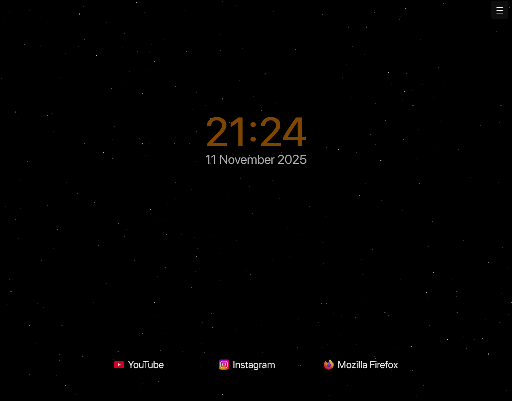
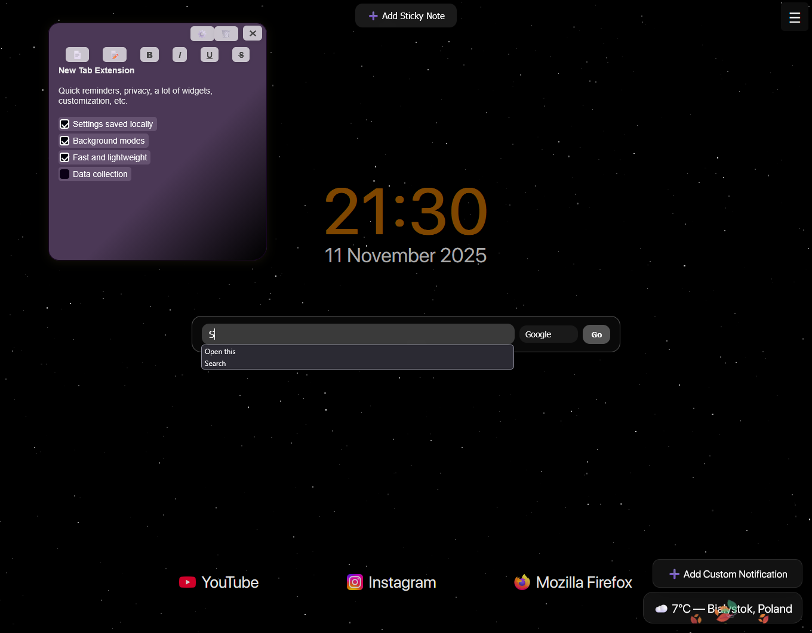
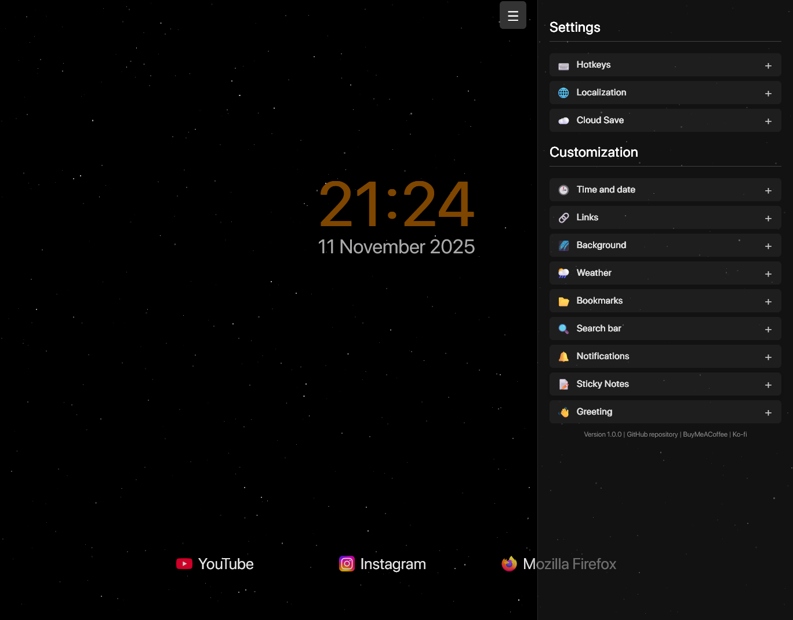
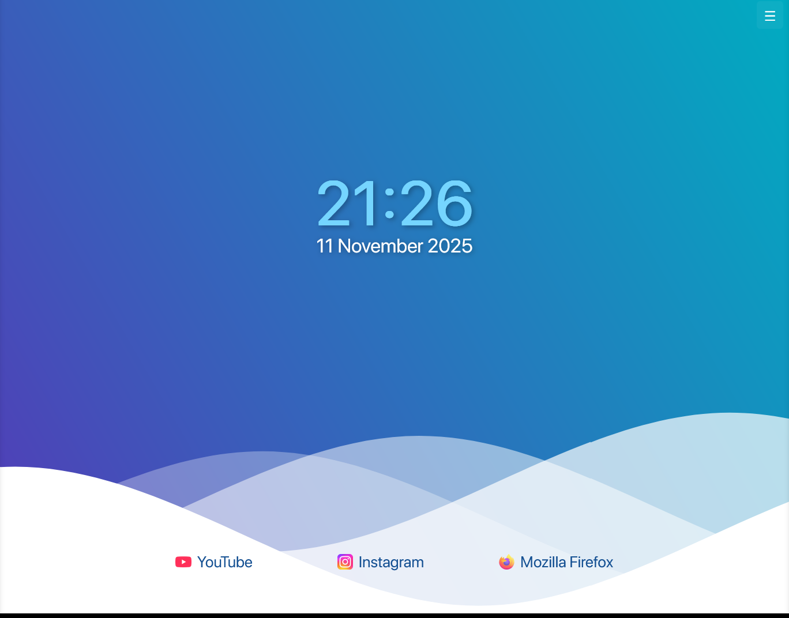
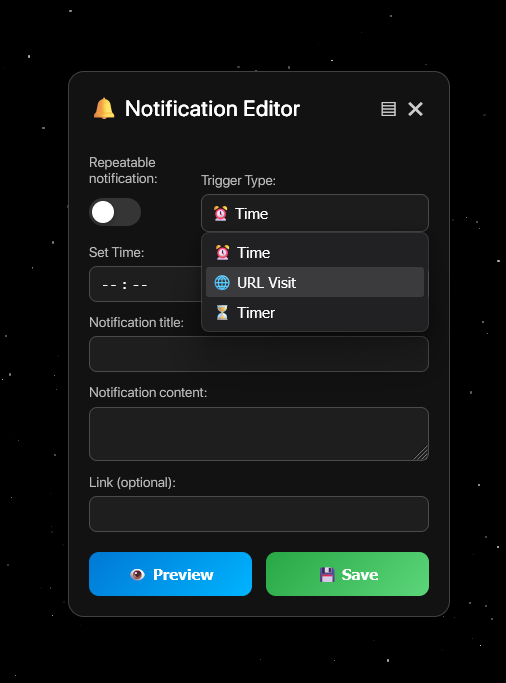
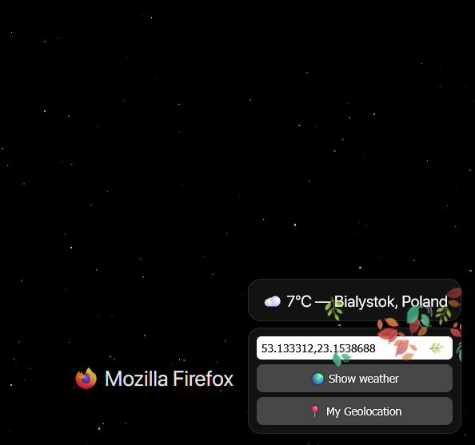

# 🌌 New Tab Extension ([Addons.Mozilla.org](https://addons.mozilla.org/en-US/firefox/addon/newtabaddon/))

**New Tab Extension** is a minimalist browser extension that:

- Replaces Firefox's default new tab page
- Lets you choose from multiple animated or static backgrounds
- Saves your preferences locally using `localStorage`
- Works entirely offline - no external servers or dependencies

## Screenshots

### Main page

### Bookmarks and widgets

### Sidebar

---

## How to Load the Extension Temporarily (via `about:debugging`)

1. Open Firefox
2. Go to: `about:debugging#/runtime/this-firefox`
3. Click **"Load Temporary Add-on"**
4. Select the `manifest.json` file from your extension folder

> ⚠️ Temporary extensions are removed when Firefox restarts.

## How to Set It as Your Homepage

To make the extension your homepage:

1. Open Firefox settings (`about:preferences`)
2. Scroll to **Home > New Windows and Tabs**
3. Under **New tabs**, select **Custom URLs...**
4. Enter: `moz-extension://<your-extension-id>/index.html`

> You can find your extension ID in `about:debugging` after loading it.

## 🛠 Features

- 🎨 Multiple background modes: stars, particles, grids, images, and more
- 💾 Settings saved locally - no cloud, no sync required
- 📅 Customizable time and date formats
- 📝 Sidebar with:
  - Weather widget with location support
  - Notifications manager to notify about various options
  - Background customization options
  - etc.
- ⏰ Time customization (12/24 hour format, date format)
- ⚡ Fast and lightweight - no performance impact
- 🔒 Private — no data collection, no analytics

## 💡 Developer Notes

- Built with vanilla JavaScript, HTML, and CSS
- Uses `localStorage` for persistent settings
- Supports multiple background modes: stars, particles, grids, images, and more
- Includes a sidebar with sticky notes, weather widget, quotes widget, and time customization
- Designed to be lightweight and fast, with no external dependencies
- Designed to be easily modifiable
