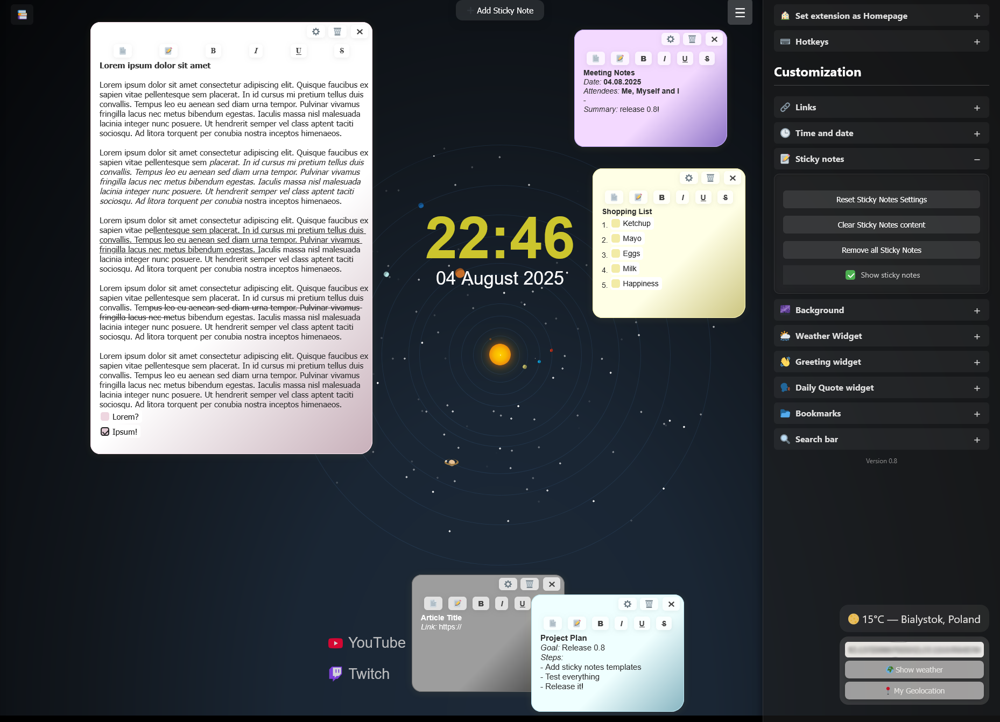
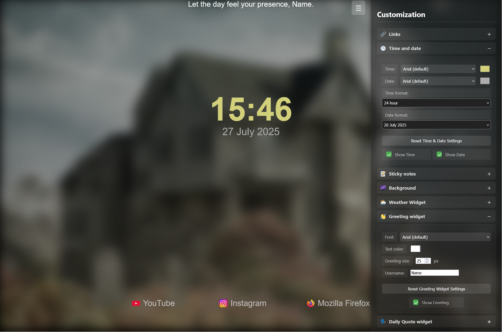

# 🌌 New Tab Extension ([Addons.Mozilla.org](https://addons.mozilla.org/en-US/firefox/addon/new_tab_extension/))

---

## What Is This?

**New Tab Extension** is a minimalist browser extension that:

- Replaces Firefox's default new tab page
- Lets you choose from multiple animated or static backgrounds
- Saves your preferences locally using `localStorage`
- Works entirely offline - no external servers or dependencies

---

## How to Load the Extension Temporarily (via `about:debugging`)

1. Open Firefox
2. Go to: `about:debugging#/runtime/this-firefox`
3. Click **"Load Temporary Add-on"**
4. Select the `manifest.json` file from your extension folder

> ⚠️ Temporary extensions are removed when Firefox restarts.

---

## How to Set It as Your Homepage

To make the extension your homepage:

1. Open Firefox settings (`about:preferences`)
2. Scroll to **Home > New Windows and Tabs**
3. Under **New tabs**, select **Custom URLs...**
4. Enter: `moz-extension://<your-extension-id>/index.html`

> You can find your extension ID in `about:debugging` after loading it.

---

## 🛠 Features

- 🎨 Multiple background modes: stars, particles, grids, images, and more
- 💾 Settings saved locally - no cloud, no sync required
- ⚡ Fast and lightweight - no performance impact
- 🔒 Private — no data collection, no analytics

---

## 💡 Developer Notes

- Built with vanilla JavaScript, HTML, and CSS
- Uses `localStorage` for persistent settings
- Designed to be easily modifiable
